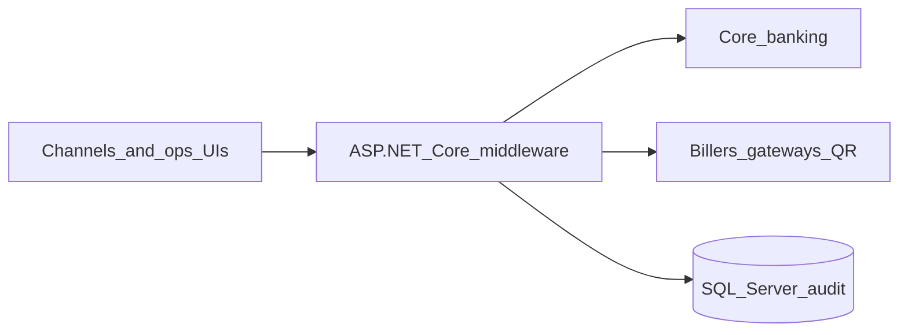

# Akib Hasan — Portfolio

**.NET Backend & Integration Engineer**  
Payments middleware · Core banking APIs · Dual-control workflows

**Live site:** [AkibHasan2.github.io/Portfolio](https://AkibHasan2.github.io/Portfolio/)  
**LinkedIn:** [linkedin.com/in/akib-hasan-iz](https://www.linkedin.com/in/akib-hasan-iz)

This public repository is the **narrative layer** of my work: sanitized case studies, architecture notes, and the portfolio website. It is **not** the source of the banking systems themselves.

---

## How to read this work

Banking middleware cannot be open-sourced. Recruiters and engineers should treat this repo the way they would a published architecture brief:

| You will find here | You will not find here |
| --- | --- |
| Public project names and problem/solution write-ups | Proprietary `.cs` / `.sql` / React ops source |
| Sanitized architecture diagrams and design decisions | Credentials, keys, account numbers, production URLs |
| Stack, workflows, and failure/recovery thinking | Internal CBS field names, partner brands, real endpoints |
| Links to live case studies | Copy-paste “run this bank API locally” |

**Private systems stay private.** The implementations live in private repos or employer environments. This repo exists so you can still evaluate how I think and what I shipped.

---

## Selected systems

All names below are **public-safe**. Full write-ups: live case study + GitHub brief.

| Project | What it is | Brief | Case study |
| --- | --- | --- | --- |
| Utility bill payment platform | Maker/checker middleware: CBS debit then multi-biller confirm via Conductor | [docs](docs/projects/utility-payments.md) | [site](https://AkibHasan2.github.io/Portfolio/work/utility-payments) |
| Bond investment & transfer | Full-stack purchase/transfer, inventory, CBS posting, QR certificates | [docs](docs/projects/bond-platform.md) | [site](https://AkibHasan2.github.io/Portfolio/work/bond-platform) |
| Document authenticity QR | Encrypted QR generate/verify with identity-gated public portal | [docs](docs/projects/document-qr.md) | [site](https://AkibHasan2.github.io/Portfolio/work/document-qr) |
| Channel fund transfer | Partner channels verify and credit deposit / DPS / loan via CBS | [docs](docs/projects/fund-transfer.md) | [site](https://AkibHasan2.github.io/Portfolio/work/fund-transfer) |
| Conversation logging | Reusable ASP.NET Core middleware: conversation IDs + SQL API logs | [docs](docs/projects/conversation-logging.md) | [site](https://AkibHasan2.github.io/Portfolio/work/conversation-logging) |
| Balance monitoring & alerts | Node.js cron: threshold checks, retry, email/SMS with daily caps | [docs](docs/projects/balance-alert.md) | [site](https://AkibHasan2.github.io/Portfolio/work/balance-alert) |



Recurring craft: **verify → authorize → post → confirm → record**, with maker/checker dual control and explicit failure states.

---

## Stack (evidenced)

.NET 8 · ASP.NET Core · SQL Server · Dapper · Stored procedures · JWT · Netflix Conductor · SignalR · React · Redux · AES-256-GCM · Cloudflare Turnstile · Node.js / Express · Serilog

---

## Source policy

1. **Do not expect GitHub clones of production bank code.** That would be a compliance failure, not a portfolio flex.
2. **This website repo is public on purpose** — it contains only sanitized copy, diagrams, and front-end for the portfolio itself.
3. **Interview depth** is available: architecture, status lifecycles, retry/rerun, inventory locking, token design. Ask for a walkthrough.
4. Optional later: a **stub demo** with fake CBS adapters. Not required to understand the work, and never a dump of real systems.

If a repo named like the internal systems appears as Public on my account, that is a mistake — it should be Private.

---

## This website (local)

```bash
cd frontend
cp .env.example .env
npm install
npm run dev
```

GitHub Pages builds with `VITE_USE_DB=false` (static content only). Pushing `main` deploys via Actions.

---

## License

Portfolio site and public briefs: personal / recruiter use.  
Underlying banking systems: proprietary, not licensed from this repository.
