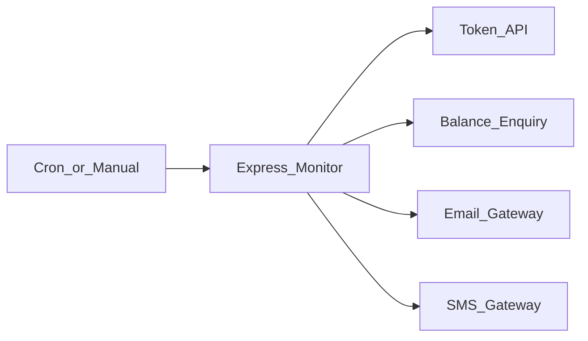

# Account Balance Monitoring & Alert Service

**Public name only.** Source is proprietary and is not in this repository.

**Live case study:** https://AkibHasan2.github.io/Portfolio/work/balance-alert

## Problem

Settlement and operational accounts must stay above a funding minimum so payments and clearing continue. Manual watching is slow and easy to miss.

## What I built

A Node.js/Express process that loads accounts and a threshold from configuration, obtains a bearer token, queries available balance for each account, retries to confirm a sustained low reading, then sends email and SMS through internal gateways — subject to a daily per-account cap. Cron runs automatically; a GET endpoint triggers the same path on demand. No database; daily counters are in-memory.

## Stack

Node.js · Express · node-cron · Axios · dotenv

## Architecture (sanitized)

## Design decisions

- **Retry before treating a balance as low** — avoid paging ops on a transient enquiry.
- **Daily per-account notification caps** so a stuck-low account does not flood email/SMS.
- **Cron plus a manual HTTP trigger** sharing one check path.

## Not published

Account numbers, thresholds, recipient mobiles, token credentials, production enquiry URLs, message templates with bank branding.
