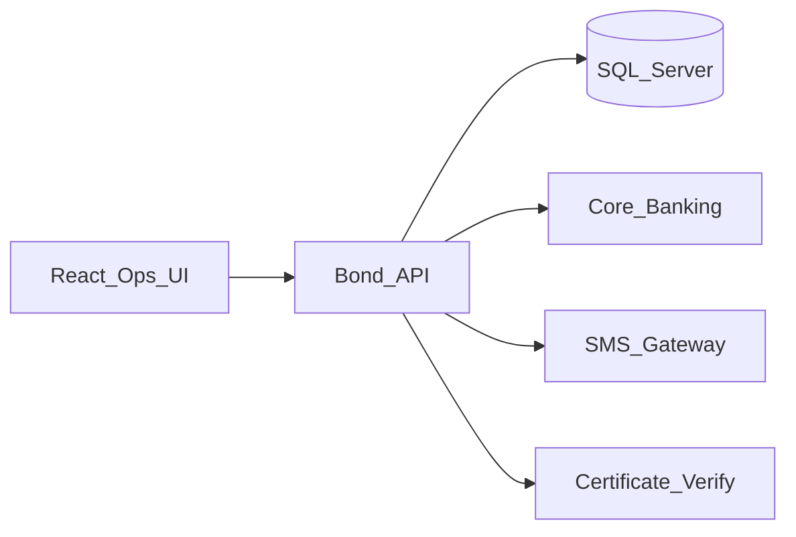

# Enterprise Bond Investment & Transfer Platform

**Public name only.** Source is proprietary and is not in this repository.

**Live case study:** https://AkibHasan2.github.io/Portfolio/work/bond-platform

## Problem

Banks need a controlled channel for customers to buy bonds and later transfer ownership. Manual processing risks payment errors, weak dual control, inconsistent inventory, and hard-to-verify paper certificates.

## What I built

Makers capture investor, nominee, payment, and bond details; checkers approve or reject. On approval, middleware posts to CBS, reserves/allocates bonds, generates PDF certificates with QR verification tokens, and can notify by SMS. A parallel transfer flow moves holdings (including partial transfer), invalidates old certificates, and issues new ones. React operations UI for the branch workflows.

## Stack

.NET 8 · SQL Server stored procedures · Dapper · React · Redux · Vite · iText7 · AES-GCM

## Architecture (sanitized)

## Design decisions

- **Inventory reserve before checker approval** so two makers cannot oversell the same units.
- **Dual control for purchase and transfer** — payment posting and ownership change stay separated from capture.
- **Short-lived verification tokens** on certificates; old PDFs invalidate when holdings transfer or split.

## Not published

Bond register schemas, SP catalogs, customer/NID fields, encryption keys, bank UI chrome beyond sanitized gallery shots, production URLs.
