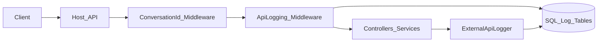

# ASP.NET Core Conversation & API Logging Middleware

**Public name only.** Employer-specific library source is not in this repository.

**Live case study:** https://AkibHasan2.github.io/Portfolio/work/conversation-logging

## Problem

APIs that span multiple services and external providers are hard to debug without a shared conversation ID and durable request/response logs.

## What I built

A reusable class library that registers via DI and pipeline extensions. Incoming requests get a ConversationId; middleware captures request/response bodies (with size limits) to SQL Server. Outbound integrations can log via an external-call logger under the same conversation.

## Stack

.NET 8 · ASP.NET Core Middleware · Dapper · SQL Server

## Architecture (sanitized)

## Design decisions

- **Reusable library**, not per-host copy-paste.
- **Correlate outbound calls** under the inbound conversation id.
- **Size limits and non-fatal log failures** so logging cannot take down the business path.

## Not published

Real request/response payloads, connection strings, host-specific table catalogs, production sinks.
