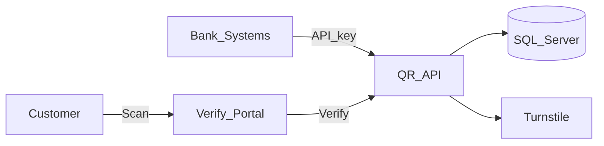

# Central Document Authenticity QR Platform

**Public name only.** Source is proprietary and is not in this repository.

**Live case study:** https://AkibHasan2.github.io/Portfolio/work/document-qr

## Problem

Bank systems issue PDFs that customers and third parties need to trust. Without a shared verification channel, checks are manual and easy to forge. Each line of business should not reinvent encryption, QR printing, or identity gates.

## What I built

Integrating systems call a protected Generate API with document metadata. The platform dual-encrypts the payload (AES-256-GCM), stores a record, and returns a PNG QR for PDFs. Customers scan an opaque `?t=` token, pass an identity challenge and Cloudflare Turnstile, then view verified fields.

## Stack

ASP.NET Core · SQL Server stored procedures · Dapper · React · Redux Toolkit · AES-256-GCM · Cloudflare Turnstile

## Architecture (sanitized)

## Design decisions

- **Opaque tokens in the QR**, not ciphertext — links stay short; payload never rides in the barcode.
- **Two-step verify** — the link alone only shows an identity challenge; fields appear after Last4/Exact match plus Turnstile.
- **CAPTCHA on identity submit, not on generate** — integrating systems authenticate with an API key and cannot complete a widget.

## Not published

System API keys, encryption keys, real document payloads, production verify hosts, branded logos.
