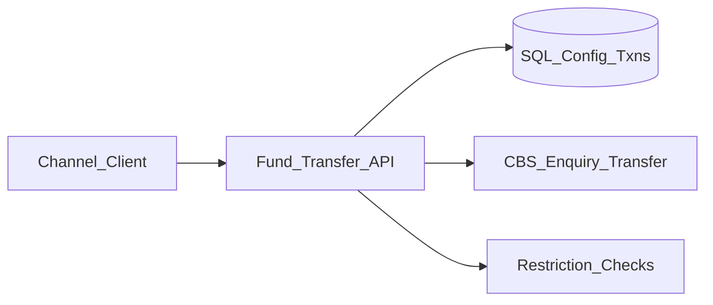

# Enterprise Channel Fund Transfer Middleware

**Public name only.** Source is proprietary and is not in this repository.

**Live case study:** https://AkibHasan2.github.io/Portfolio/work/fund-transfer

## Problem

External digital channels need a controlled way to credit bank accounts (deposits, DPS installments, loan repayments) without direct access to core banking.

## What I built

A dedicated REST API between the channel and CBS. It validates product/channel configuration and debit-account mapping, verifies the credit account via CBS enquiry (plus restriction checks where required), executes transfer through the correct CBS operation, persists results, and exposes status enquiry by client transaction ID.

## Stack

.NET 8 · ASP.NET Core · Dapper · SQL Server · JWT · Serilog · HttpClient

## Architecture (sanitized)

## Design decisions

- **Channels never call CBS directly** — onboarding stays configuration-driven.
- **ClientTxnID uniqueness** as the idempotency key before a second CBS credit.
- **Product-specific verify rules** for deposit vs DPS vs loan, behind one API shape.

## Not published

Channel client secrets, debit-account maps, CBS operation codes, linked-server details, real transaction payloads.
