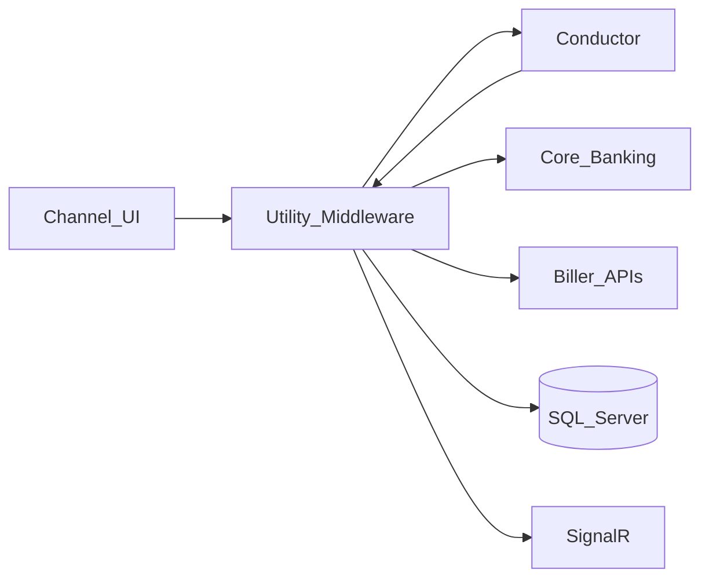

# Enterprise Utility Bill Payment Integration Platform

**Public name only.** Source is proprietary and is not in this repository.

**Live case study:** https://AkibHasan2.github.io/Portfolio/work/utility-payments

## Problem

Banks collect utility bills for many providers. Each provider has different APIs and auth. A payment must debit the customer through core banking, then confirm with the biller — under dual control, branch rules, and service-time windows. Failures have to be recoverable without double-charging.

## What I built

An ASP.NET Core REST middleware that standardizes bill fetch, maker submit, and checker approve. On approval, Netflix Conductor orchestrates CBS debit (cash / account / cheque) then biller confirmation. Statuses and errors are persisted; completed payments can notify clients via SignalR; failed steps support controlled retry/rerun.

## Stack

.NET 8 · ASP.NET Core · SQL Server · Dapper · Netflix Conductor · SignalR · JWT

## Architecture (sanitized)

## Design decisions

- **Orchestrate settlement outside the request** — approve → CBS debit → biller confirm can fail mid-path; Conductor owns retries so the API stays a façade with durable status.
- **Explicit failure statuses** — CBSERROR / FAILED plus audit trails, not silent undifferentiated retries.
- **Config-driven multi-biller façade** — provider quirks stay behind one contract.

## Not published

Internal biller routes, CBS payloads, credentials, account data, workflow instance names, production hosts.
